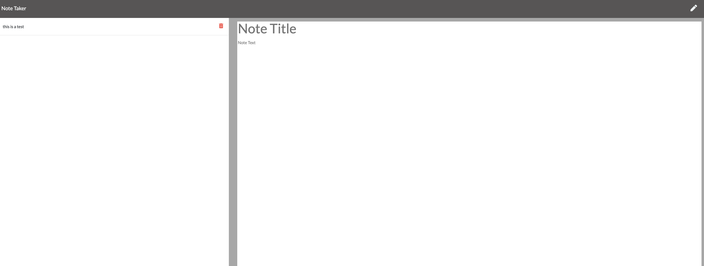

# Note Taker

## Description
### This app was developed to keep track of notes. The user writes a note and upon entering both the title and the decription, the save button becomes active. When the user clicks the save icon the notes is then stored via locally storage and the users' note appears to the left of the screen. The note can then be removed by clicking the trash can to delete the note. This app was developed using Node.js, jvascript, and HTML. the app has been deployed to heroku at the following link:[heroku link- Note Taker](https://notetakingapp1.herokuapp.com/)

## Homepage 

## Notes Home

## Create a note

## Delete a Note

## Video of app functionality

https://user-images.githubusercontent.com/79549867/118413418-40377980-b66d-11eb-80e0-bfc811c33269.mov

# View webpage at : [Note Taker](https://notetakingapp1.herokuapp.com/)
